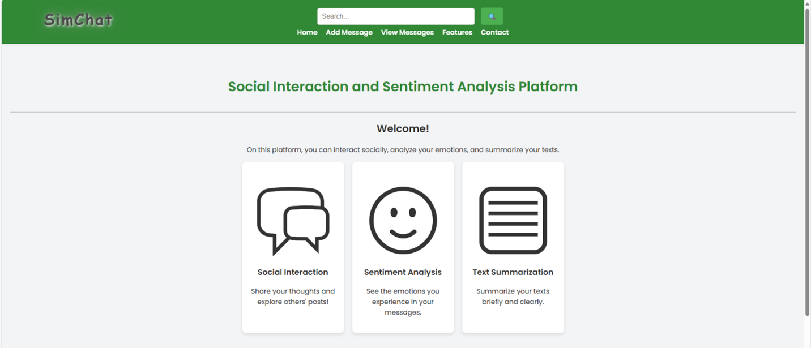
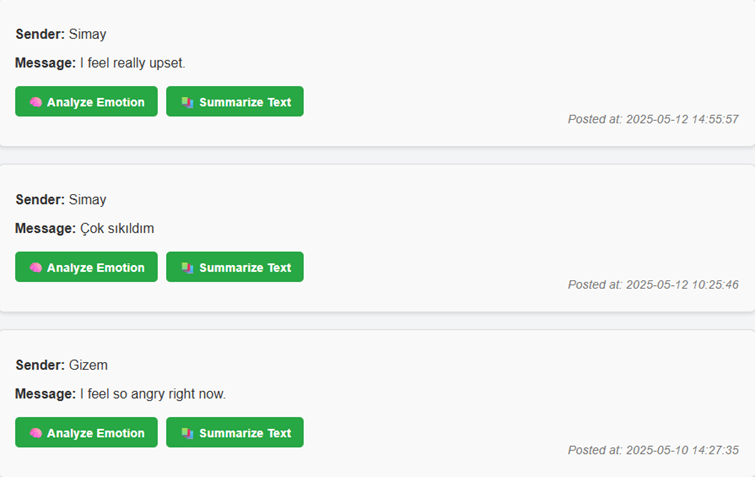
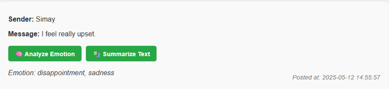
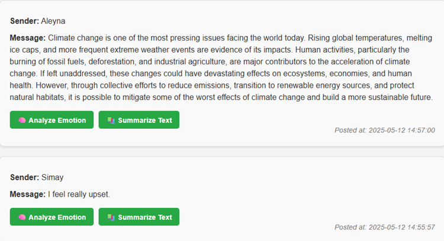
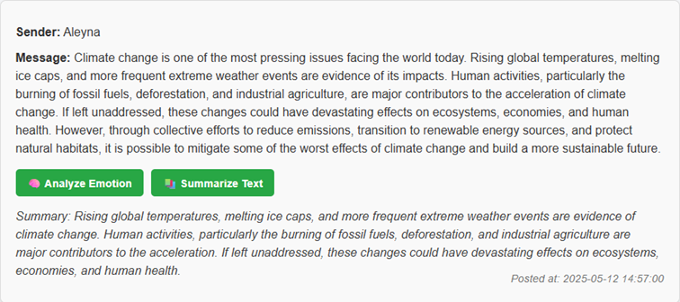

# SimChat – Web Tabanlı Duygu Analizi ve Metin Özetleme Platformu

> **⚠️ Önemli Not:** Bu projenin kaynak kodları, fikri mülkiyet ve ticari potansiyeli nedeniyle özel (private) bir GitHub deposunda tutulmaktadır. Bu sayfa sadece projenin görsel ve fonksiyonel yeteneklerini sergilemek amacıyla oluşturulmuştur.

---

## Proje Hakkında

SimChat, kullanıcılar arası sosyal etkileşimi yönetirken, aynı zamanda NLP (Doğal Dil İşleme) modelleri aracılığıyla anlık duygu analizi ve metin özetleme yetenekleri sunan web tabanlı bir platformdur.

---

## 1. Ana Sayfa ve Kullanıcı Arayüzü (Frontend)

**Açıklama:**
SimChat'in **Ön Yüz (Frontend)** katmanı **HTML, CSS ve JavaScript** teknolojileri kullanılarak geliştirilmiştir. Arayüz; **kullanıcı dostu, sade ve sezgisel** bir deneyim sunacak şekilde tasarlanmıştır. Kullanıcılar uygulama ile temel olarak iki ana web arayüzü üzerinden etkileşim kurar: **Mesaj Giriş Sayfası** ve **Mesaj Görüntüleme & Analiz Sayfası.**

---
### Ana Sayfa Görünümü

#### Görsel 1: Üst Bölüm (Başlık ve Menü)

#### Görsel 2: Alt Bölüm (Ana Özellikler)

---

## 2. Duygu Analizi ve Uygulama Akışı

### 2.1. Genel Uygulama Akışı (General Application Flow)

SimChat kullanıcıları, sisteme İngilizce mesajlarını yükleyerek iki temel hizmetten yararlanabilirler:

* **Duygu Analizi (Emotion Analysis):** Kullanıcının mesajında bulunan duyguyu (emotion) tespit eder.
* **Metin Özetleme (Text Summarization):** Yüklenen uzun metinleri kısaltır.

Bu bölümde, Duygu Analizi modülünün çalışma akışı üç aşamalı görsel ile sunulmuştur:

---

### 2.2. Duygu Analizi Modülü Akışı

#### Görsel 1: Mesaj Girişi

Kullanıcı, arayüz üzerinden mesajını yazar ve gönderir.

#### Görsel 2: Mesajın Sisteme Kaydedilmesi

Gönderilen mesaj, bir sonraki analiz ve görüntüleme aşaması için sisteme kaydedilir.

#### Görsel 3: Anlık Duygu Analizi Sonucu

Kayıt edilen mesaj, arka planda NLP modeline iletilir ve mesajın baskın duygusu anlık olarak etiketlenir ve görüntülenir.

---

### 2.3. Teknik Detay (İş Akışı)

Duygu analizi, Hugging Face'in Transformer kütüphanesi üzerine kurulmuştur ve **DistilBERT** mimarisi baz alınmıştır. Bu süreçte kritik adımlar şunlardır:

* **Model Seçimi:** Spesifik duygu tespiti için fine-tune edilmiş **`bhadresh-savani/bert-base-go-emotion`** modeli kullanılmıştır. Bu model, 28 farklı duygu kategorisini (joy, sadness, anger, fear, vb.) çoklu etiketleme (multi-label) yöntemiyle analiz eder.
* **İş Akışı:** Gelen İngilizce mesajlar doğrudan modele iletilir. Model, bir **sigmoid aktivasyon fonksiyonu** uygulayarak çıktı üretir.
* **Güven Eşiği:** Duygu etiketlerinden, **%0.2'nin üzerindeki** güven skoruna sahip olanlar seçilerek (confidence score > 0.2) kullanıcıya sunulur. Bu, hassasiyet ve kesinlik arasında bir denge sağlar.
* **Arka Uç (Backend):** Bu süreçlerin tamamı **Django** (Python) framework'ü üzerinde yönetilmektedir.

---

## 3. Metin Özetleme Modülü (Text Summarization)

### 3.1. Genel Akış ve Özellik

Bu modül, kullanıcıların yüklediği uzun metinlerin ana fikrini kaybetmeden hızlı ve verimli bir şekilde özetlenmesini sağlar. Bu özellik, kullanıcıların yoğun mesaj trafiğini veya uzun haber metinlerini kolayca sindirmesine yardımcı olur.

---

### 3.2. Metin Özetleme Modülü Akışı

#### Görsel 1: Metin Girişi

Kullanıcı, özetlenmesini istediği uzun metni ilgili alana yapıştırır.

#### Görsel 2: Metnin Sisteme Kaydedilmesi ve Görüntülenmesi

Gönderilen orijinal metin, sisteminize kaydedilir ve kullanıcının takip edebilmesi için görüntülenir.

#### Görsel 3: Özetleme Sonucu (Çıktı)

Sistem, orijinal metni arka plandaki **BART** modeline ileterek kısa, öz ve akıcı bir özet metin oluşturur ve kullanıcıya sunar.

---

### 3.3. Teknik Detay (İş Akışı)

Metin özetleme fonksiyonu, uzun metinlerin anlamsal bütünlüğünü koruyarak özetlenmesini sağlar.

* **Model Seçimi:** Yüksek kaliteli özetleme için **Encoder-Decoder mimarisine** sahip **`facebook/bart-large-cnn`** modeli kullanılmıştır. Model, özellikle haber makaleleri gibi uzun içerikleri özetlemek üzere eğitilmiştir.
* **Özetleme Yöntemi:** Model, anlamsal olarak tutarlı özetler üretmek için **Beam Search** algoritmasını kullanır.
* **Kısa Metin Yönetimi:** Kullanıcı deneyimini artırmak amacıyla, eğer girdi mesajı **çok kısaysa (örneğin 20 kelimeden az)**, sistem özetlemeyi atlar ve orijinal metni olduğu gibi döndürür. Bu, anlamsal tutarsızlığı önler.

---

## 4. Kullanılan Temel Teknolojiler ve Kütüphaneler

* **Backend Framework:** **Django** (Python) – URL yönlendirme, form yönetimi ve NLP servislerinin tetiklenmesi için.
* **Derin Öğrenme / NLP:**
    * **Duygu Analizi:** **DistilBERT** tabanlı (`bhadresh-savani/bert-base-go-emotion`).
    * **Metin Özetleme:** **BART** tabanlı (`facebook/bart-large-cnn`).
* **NLP Kütüphaneleri:** **transformers** (Hugging Face), **PyTorch (torch)** (tensör işlemleri için), **nltk** (ön işleme için).
* **Diğer Python Kütüphaneleri:** **fuzzywuzzy** (dizge benzerliği hesaplama ve sayfa yönlendirmesi için).
* **Frontend:** **HTML, CSS, JavaScript** – Temiz, duyarlı ve kullanıcı dostu arayüz tasarımı.
* **Veritabanı:** SQLite (varsayılan), PostgreSQL'e geçiş yapılabilir.

---

